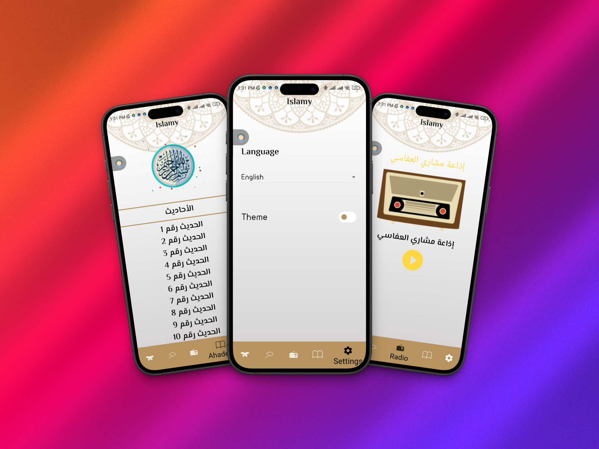
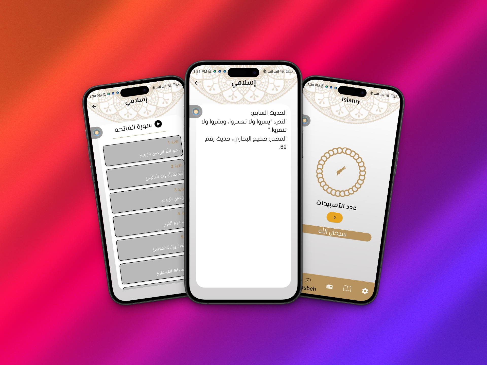
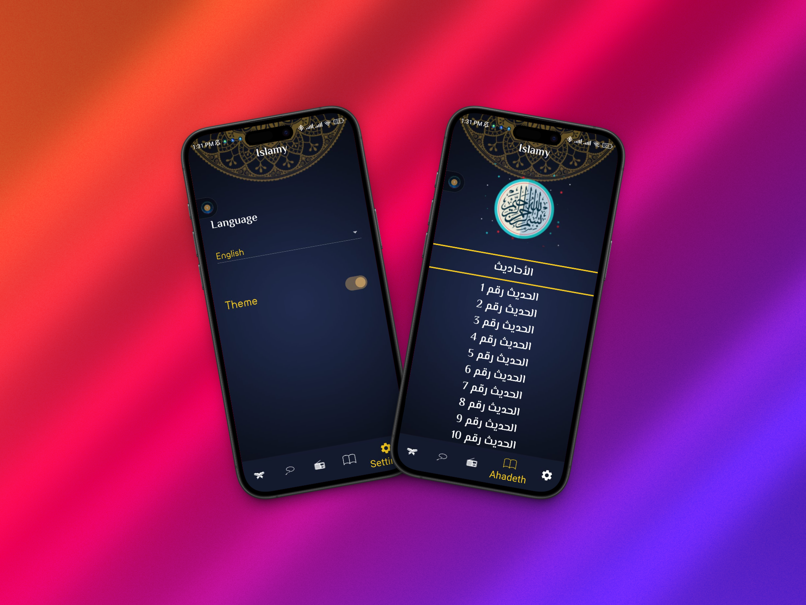
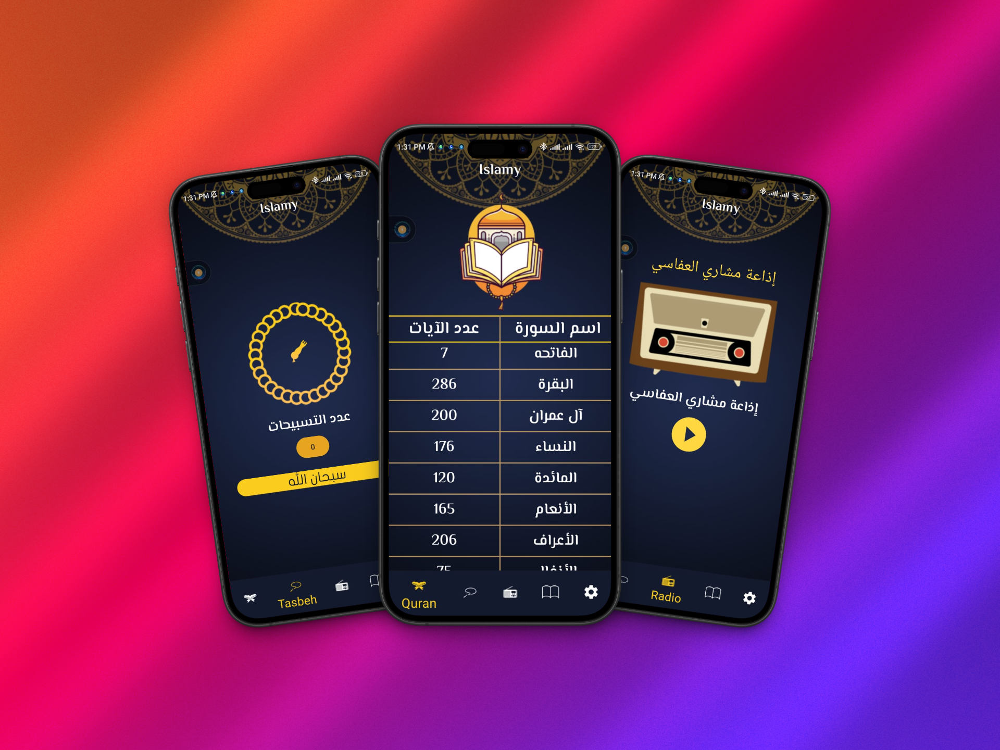
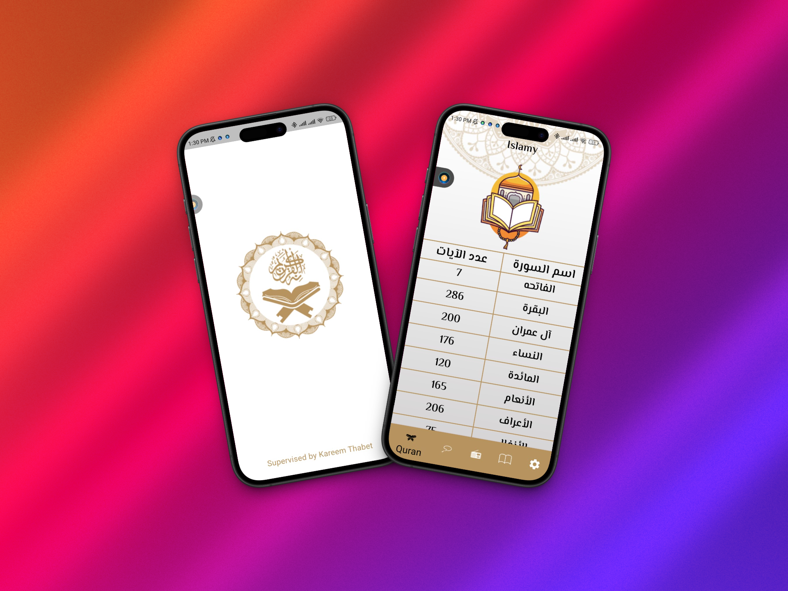
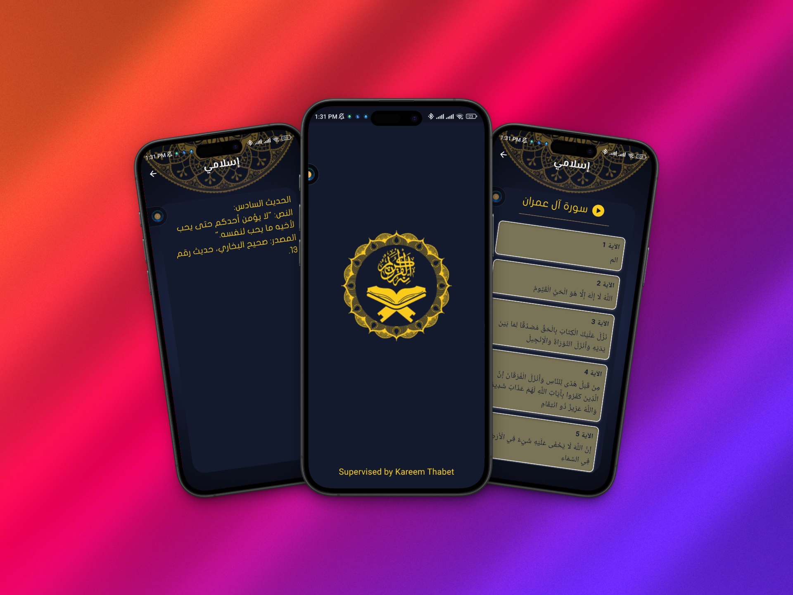

# 🌙 Deeni – Spiritual Flutter App

**Deeni** is a beautifully crafted app developed with **Flutter**, designed to support your daily spiritual journey. Whether you're reading sacred texts, listening to peaceful recitations, or engaging in remembrance — **Deeni** helps you stay connected to your values and inner peace.

---

## 📹 Demo

<div align="center">
  <video src="https://github.com/user-attachments/assets/2d5fef9e-ed35-441f-84a6-88e22a50439b" controls width="480" style="border-radius: 12px;"></video>
</div>

---

## 📸 Screenshots

<div align="center">

<table>
  <tr>
    <td></td>
    <td></td>
    <td></td>
  </tr>
  <tr>
    <td><b>Home</b></td>
    <td><b>Quran Reader</b></td>
    <td><b>Daily Dhikr</b></td>
  </tr>
</table>

<br/>

<table>
  <tr>
    <td></td>
    <td></td>
    <td></td>
  </tr>
  <tr>
    <td><b>Spiritual Radio</b></td>
    <td><b>Hadith & Wisdom</b></td>
    <td><b>Dark Mode</b></td>
  </tr>
</table>

</div>

---

## 📱 Features

- 📖 **Quran Reader**  
  Read the Quran with a clean, user-friendly interface.

- 🕌 **Daily Remembrance (Dhikr)**  
  Includes morning & evening Azkar and uplifting supplications.

- 📻 **Spiritual Radio**  
  Stream recitations and reflections 24/7 directly from the app.

- 📜 **Wisdom & Hadith**  
  Browse and read authentic narrations and spiritual insights.

- 🌓 **Dark Mode**  
  Relax your eyes with a beautifully styled dark mode.

---

## 💡 Why “Deeni”?

> *Deeni* (ديني) means "**my religion**" in Arabic — a personal and heartfelt expression of one’s spiritual path.  
> This app was created to help you live your **Deen** with ease and comfort, using technology to stay mindful and spiritually connected.

---

## 🛠️ Tech Stack

- **Flutter**  
- **Dart**  
- **API**  
- **State Management**  

---

## 🚀 Getting Started

```bash
git clone https://github.com/karemthabet/Deeni_App.git
cd Deeni_App
flutter pub get
flutter run
